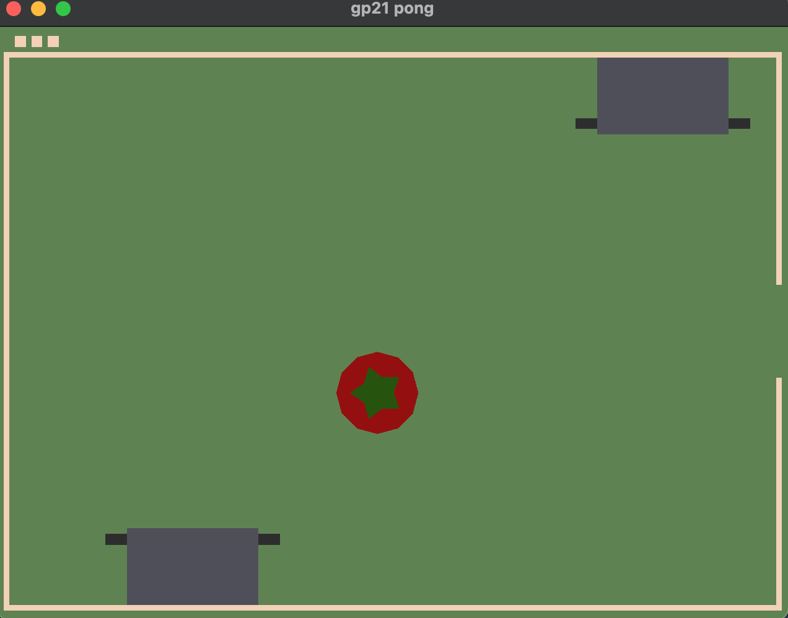

# HotPotaPong

Author: Emma Liu

Design:  You are an Italian chef in a tomato-soup-showdown with an AI, and you absolutely hate potatoes. But the vegetables you bought are fickle, and can't decide if they want to be potatoes or tomatoes. Your objective is to collect as many tomatoes as possible (and prevent all of them from being wasted), and avoid spoiling your soup with a tepid tuber, better than your foe.

Screen Shot:

How To Play:

The AI is the top pot, and you control the bottom pot with your mouse. Vegetables will be sprung from the entrance on the right. Hover your pot under an incoming vegetable to collect it into your soup. Collect tomatoes in the pot to earn a point, and avoid dropping any tomatoes on your floor (you'll ruin the veggie and lose a point). If you collect a potato, you'll lose a point; best just let it bounce around (no penalty) until it makes up its mind...

This game was built with [NEST](NEST.md).
